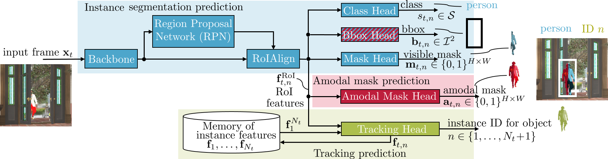

# End-to-end Amodal Video Instance Segmentation

This repository provides the official PyTorch implementation for the QD-based VATrack method of the following paper: 

> [**End-to-end Amodal Video Instance Segmentation**](https://to-do)<br>

> **Abstract:** 
*Amodal perception is the important ability of humans
to imagine the entire shape of objects that are occluded.
This ability is crucial for safety-relevant perception tasks
such as autonomous movement of robots and vehicles. Existing
methods mostly focus on amodal perception in single
images. However, video understanding is important for
amodal perception as it provides additional cues for perceiving
occlusions. In this paper, we are the first to present
an end-to-end trainable amodal video instance segmentation
method. Specifically, we present a strategy to extend
existing instance segmentation models by an amodal mask
branch as well as a tracking branch, inspired by video instance
segmentation (VIS) methods. The tracking branch
allows to not only predict amodal and visible masks at the
same time, but also to connect them over time by predicting
video-based instance IDs. Our video-based method
VATrack outperforms the existing image-based state-ofthe-
art methods on the commonly used SAIL-VOS dataset’s
benchmarks in all amodal metrics, while also improving
most modal (i.e., visible) metrics. Additionally, we introduce
a novel video-based evaluation where our method may
serve as a baseline for future research on amodal VIS. Code
for VATrack will be published on github.*

## VATrack method

Functioning of our VATrack method.

## Getting Started

📝 Our code is heavily derived from [PCAN](https://github.com/SysCV/pcan) and [mmtracking](https://github.com/open-mmlab/mmtracking). Please also cite their work if you use this code in your research.

###Requirements

Our code was run on a SLURM-based GPU cluster. So we also provide slurm scripts to run our code.
To run our code, we require:
- Linux | macOS | Windows
- Nvidia A100 GPU with 40GB RAM (for less available RAM batch sizes might be reduced)
- Code was run using Python 3.7
- Code was run using CUDA 11.0+
- [Anaconda](https://www.anaconda.com/)
- [MMCV](https://github.com/open-mmlab/mmcv)
- [MMDetection](https://github.com/open-mmlab/mmdetection)

### Installation
```
conda create -n {env_name} python=3.7 -y
conda activate {env_name}
conda install pytorch==1.7.0 torchvision==0.8.0 torchaudio==0.7.0 cudatoolkit=11.0 -c pytorch
conda install seaborn
conda install -c anaconda scikit-image
pip install mmcv-full==1.2.7 -f https://download.openmmlab.com/mmcv/dist/cu110/torch1.7/index.html
pip install motmetrics opencv-python mmdet==2.10.0
cd {project_folder}
python setup.py develop
cd mmtracking-0.5.1
python setup.py develop
pip install --upgrade pandas==1.3.0
cd ..
```

#####Modify environment to be able to load Sail-VOS-cut data:
```
cp env_modification/vatrack/* {path_to_env}/lib/python3.7/site-packages/mmdet/datasets/pipelines/
```

### Preparing the Data

#####1. Download the [SAIL-VOS](http://sailvos.web.illinois.edu/_site/index.html#download_dataset) dataset.

   We employ our code using the following structure, where SAIL-VOS should be downloaded to `sailvos_complete_png`:
    

    ├── data
    │   ├── sailvos_cut_json
    │   │   ├── amodal
    │   │   │   ├── train.json
    │   │   │   ├── valid.json
    │   │   ├── visible
    │   │   │   ├── train.json
    │   │   │   ├── valid.json
    │   │   ├── joint
    │   │   │   ├── train.json
    │   │   │   ├── valid.json
    │   ├── sailvos_cut_png
    │   │   │   ├── xxx{video identifier]
    │   │   │   │   ├── images
    │   │   │   │   │   ├── xxx1{frame identifier, png file]
    │   │   │   │   │   ├── xxx2{frame identifier, png file]
    │   ├── sailvos_complete_json
    │   │   ├── amodal
    │   │   │   ├── train.json
    │   │   │   ├── valid.json
    │   │   ├── visible
    │   │   │   ├── train.json
    │   │   │   ├── valid.json
    │   │   ├── joint
    │   │   │   ├── train.json
    │   │   │   ├── valid.json
    │   ├── sailvos_complete_png
    │   │   │   ├── xxx{video identifier]
    │   │   │   │   ├── images
    │   │   │   │   │   ├── xxx1{frame identifier, png file]
    │   │   │   │   │   ├── xxx2{frame identifier, png file]
    

#####2. Generating SAIL-VOS-cut and JSON files needed for training and evaluation

We **recommend** setting SAIL-VOS-cut up using our provided scripts for **easier usage**:
1) Download our json files from [here](https://drive.google.com/drive/folders/1phsuh_4vmhu6hqueHmGZnKqGo-bYtzTS?usp=sharing). They are zipped and can be unzipped in the `data` folder to create the directory structure sketched above.

2) Generate the SAIL-VOS-cut videos via dictionary:
    The dictionary `/data/sail_vos_cut_structure.json` contains the SAIL-VOS-cut video IDs and the respective frames contained in there. Each SAIL-VOS-cut video ID is derived from the original SAIL-VOS video ID, so idenfitication should be relatively easy. 
    Set the correct path to SAIL-VOS and SAIL-VOS-cut in the python file `create_sailvoscut_fromdict.py`. Then run:
    
    ```python create_sailvoscut_fromdict.py```
    
This will provide you with the necessary files and directory structure to train and evaluate our models.

To create and generate SAIL-VOS-cut on your own is possible, but a little bit more complicated:
    
1) Generation of SAIL-VOS-cut and corresponding COCO-style json files:
    
    Go to `/tools/convert_datasets/sailvos`. Change in `/tools/convert_datasets/sailvos/sailvos2coco_cut.py` the SAIL-VOS directory to your own path
    ```
    make sure you set the correct flags (directory paths) in convert_sailvoscut.sh:
    sbatch convert_sailvoscut.sh
    ```
    
    
2) SAIL-VOS-cut: Now we need to convert the resulting SAIL--VOS json files to json files usable by the VATrack model: Go to `./data/` and run
    ```
    python json_script.py
    ```
   Inside `json_script.py` please make sure to select the correct code section for your needs (you can see it by the comments)
    --> Repeat for train and val datasets (change json filenames in python file)
    
3) SAIL-VOS: repeat the above steps, but for the first conversion step change in convert_sailvoscut.sh the python call to call
     ```
    python sailvos2coco.py
    ```

<sub>If you want to do a proof of concept, we included json files for one video in the ZIP directory of our code: `./data/sailvos_cut_json/png_joint`
We provide json files for visible, amodal and both bboxes. So you should be able to use them for all methods.</sub>

## Usage
For all methods: Make sure that you set in all configs your correct paths and jsons to SAIL-VOS and SAIL-VOS-cut, respectively.

>Our checkpoints for methods trained on SAIL-VOS-cut can be downloaded from  [here](https://drive.google.com/file/d/1mNNRijec4ujsndTxAhyJtSaNPW1pILqn/view?usp=sharing) (zipped for memory reasons)
>The ResNext-101-initialized weights can be found [here](https://drive.google.com/file/d/1BQ51RZ4tzVtXaH_aHZZmj-NvVgZmfKj8/view?usp=sharing) or can be downloaded from [openmmlab](https://download.openmmlab.com/mmdetection/v2.0/mask_rcnn/mask_rcnn_x101_64x4d_fpn_1x_coco/mask_rcnn_x101_64x4d_fpn_1x_coco_20200201-9352eb0d.pth)

####1. QDTrack
For **training** QDTrack:
```
In ./tools/slurm_train.sh:
set --config as "../configs/QDTrack_SAILVOS.py" to use the SAIL-VOS dataset
set --config as "../configs/QDTrack_SAILVOScut.py" to use the SAIL-VOS-cut dataset (default: QDbasedVATrack_SAILVOScut.py)

set --work-dir as the directory you wish to save the output in (default: ../train_output/default/)

default is training with validation. 
If you do not wish to use it (speeds up training), remove the flag in ./tools/train.py (l.28)
```
To start the training:
```
cd tools
sbatch slurm_train.sh
```
To train with a different backbone (e.g. ResNet-50):
```
In ./configs/QDTrack_SAILVOS.py
1. default is training with ResNext101.
    For ResNet-50: comment lines 5-12, line 178 contains optimizer for ResNet-50.
    With ResNet-50, you can use larger batch size (for us 8 in l.86)
    You need to download the specific pretrained checkpoint from torchvision: 'torchvision://resnet50' (l.210)
```

for **evaluation**:

Our checkpoint can be found in `/ckpts_trained/QDTrack/best_ckpts_X101.pth`
```
In ./tools/slurm_test.sh (or ./tools/test.py):
set --config as "../configs/QDTrack_SAILVOS.py" to use the SAIL-VOS dataset
set --config as "../configs/QDTrack_SAILVOScut.py" to use the SAIL-VOS-cut dataset (default: QDbasedVATrack_SAILVOScut.py)

set --checkpoint to the pth file you want to test

set --out as the path to save the output.pkl file (default='../test_output/default.pkl')
```
To start the evaluation:
```
cd ./tools  
sbatch slurm_test.sh
```
additional infos:
```
in test.py line 36: per default the output is visualized. Remove the flag to reduce test speed.
in test.py line 56 sets the default threshold value for the show score threshold.
```

####2. QD-based AmodalTrack

For **training**:
```
In ./tools/slurm_train.sh:
set --config as "../configs/QDbasedAmodalTrack_SAILVOS.py" to use the SAIL-VOS dataset
set --config as "../configs/QDbasedAmodalTrack_SAILVOScut.py" to use the SAIL-VOS-cut dataset (default: QDbasedVATrack_SAILVOScut.py)

set --work-dir as the directory you wish to save the output in (default: ../train_output/default/)

default is training with validation. 
If you do not wish to use it (speeds up training), remove the flag in ./tools/train.py (l.28)
```
To start the training:
```
cd tools
sbatch slurm_train.sh
```

To train with a different backbone (e.g. ResNet-50):
```
In ./configs/QDTrack_SAILVOS.py
1. default is training with ResNext101.
    For ResNet-50: comment lines 5-12, line 178 contains optimizer for ResNet-50.
    With ResNet-50, you can use larger batch size (for us 8 in l.86)
    You need to download the specific pretrained checkpoint from torchvision: 'torchvision://resnet50' (l.210)
```

for **evaluation**:

Our checkpoint can be found in `/ckpts_trained/QDbasedAmodalTrack/best_ckpts_X101.pth`
```
In ./tools/slurm_test.sh (or ./tools/test.py):
set --config as "../configs/QDbasedAmodalTrack_SAILVOS.py" to use the SAIL-VOS dataset
set --config as "../configs/QDbasedAmodalTrack_SAILVOScut.py" to use the SAIL-VOS-cut dataset (default: QDbasedVATrack_SAILVOScut.py)

set --checkpoint to the pth file you want to test

set --out as the path to save the output.pkl file (default='../test_output/default.pkl')
```
To start the evaluation:
```
cd ./tools  
sbatch slurm_test.sh
```
additional infos:
```
in test.py line 36: per default the output is visualized. Remove the flag to reduce test speed.
in test.py line 56 sets the default threshold value for the show score threshold.
```

####3. QD-based VATrack
>Loss weights of VATrack-based methods have to be changed inside the config file

For **training**:
```
In ./tools/slurm_train.sh:
set --config as "../configs/QDbasedVATrack_SAILVOS.py" to use the SAIL-VOS dataset
set --config as "../configs/QDbasedVATrack_SAILVOScut.py" to use the SAIL-VOS-cut dataset (default: QDbasedVATrack_SAILVOScut.py)

set --work-dir as the directory you wish to save the output in (default: ../train_output/default/)

default is training with validation. 
If you do not wish to use it (speeds up training), remove the flag in ./tools/train.py (l.28)
```
To start the training:
```
cd tools
sbatch slurm_train.sh
```

To train with a different backbone (e.g. ResNet-50):
```
In ./configs/QDTrack_SAILVOS.py
1. default is training with ResNext101.
    For ResNet-50: comment lines 5-12, line 188 contains optimizer for ResNet-50.
    With ResNet-50, you can use larger batch size (for us 8 in l.96)
    You need to download the specific pretrained checkpoint from torchvision: 'torchvision://resnet50' (l.218)
```

for **evaluation**:

Our checkpoint can be found in `/ckpts_trained/QDbasedVATrack/mask_amo1.0+vis1.0.pth`
```
In ./tools/slurm_test.sh (or ./tools/test.py):
set --config as "../configs/QDbasedVATrack_SAILVOS.py" to use the SAIL-VOS dataset
set --config as "../configs/QDbasedVATrack_SAILVOScut.py" to use the SAIL-VOS-cut dataset (default: QDbasedVATrack_SAILVOScut.py)

set --checkpoint to the pth file you want to test

set --out as the path to save the output.pkl file (default='../test_output/default.pkl')
```
To start the evaluation:
```
cd ./tools  
sbatch slurm_test.sh
```
additional infos:
```
in test.py line 36: per default the output is visualized. Remove the flag to reduce test speed.
in test.py line 56 sets the default threshold value for the show score threshold.
```

###4. QD-based VATrack with two bounding box heads

>Loss weights of VATrack-based methods have to be changed inside the config file
>
For **training**:
```
In ./tools/slurm_train.sh:
set --config as "../configs/QDbasedVATrack_SAILVOS.py" to use the SAIL-VOS dataset
set --config as "../configs/QDbasedVATrack_SAILVOScut.py" to use the SAIL-VOS-cut dataset (default: QDbasedVATrack_SAILVOScut.py)

set --work-dir as the directory you wish to save the output in (default: ../train_output/default/)

default is training with validation. 
If you do not wish to use it (speeds up training), remove the flag in ./tools/train.py (l.28)
```
To start the training:
```
cd tools
sbatch slurm_train.sh
```

To train with a different backbone (e.g. ResNet-50):
```
In ./configs/QDTrack_SAILVOS.py
1. default is training with ResNext101.
    For ResNet-50: comment lines 5-12, line 218 contains optimizer for ResNet-50.
    With ResNet-50, you can use larger batch size (for us 8 in l.126)
    You need to download the specific pretrained checkpoint from torchvision: 'torchvision://resnet50' (l.248)
```

for **evaluation**:

Our checkpoint can be found in `/ckpts_trained/QDbasedVATrack_2bbox/qdbased_vatrack_2bbox.pth`
```
In ./tools/slurm_test.sh (or ./tools/test.py):
set --config as "../configs/QDbasedVATrack_SAILVOS.py" to use the SAIL-VOS dataset
set --config as "../configs/QDbasedVATrack_SAILVOScut.py" to use the SAIL-VOS-cut dataset (default: QDbasedVATrack_SAILVOScut.py)

set --checkpoint to the pth file you want to test

set --out as the path to save the output.pkl file (default='../test_output/default.pkl')
```
To start the evaluation:
```
cd ./tools  
sbatch slurm_test.sh
```
additional infos:
```
in test.py line 36: per default the output is visualized. Remove the flag to reduce test speed.
in test.py line 56 sets the default threshold value for the show score threshold.
```

## Results

####Image-level results

Amodal image-level results on the SAIL-VOS-cut validation data for our methods. Note that QDTrack does not predict amodal masks and thus is not represented in this Table:

| Method                   | Visible | Amodal | AP  | AP<sub>50</sub> | AP<sup>P</sup><sub>50</sub> | AP<sup>H</sup><sub>50</sub> | AP<sup>L</sup><sub>50</sub> | AP<sup>M</sup><sub>50</sub> | AP<sup>S</sup><sub>50</sub> | Link
| ---------------------    | ------- | ------ | --- | --------------- | --- | --- | --- | --- | --- | --- |
| QD-based AmodalTrack     |         |  &check;      | 17.8|   27.4          | 29.2                        |18.6 |34.7 | 26.8| 11.4| `ckpts_trained/QDbasedAmodalTrack/best_ckpts_X101.pth`
| QD-based VATrack         |      &check;   |    &check;   |18.3 | 28.6| 29.7|20.1 | 38.1|26.9|15.7 | `ckpts_trained/QDbasedVATrack/mask_amo1.0+vis1.0.pth`|
| QD-based VATrack (2bbox) |    &check;     |   &check;     | 17.9|28.6 |30.3 |19.9 |37.2|27.3|15.7| `ckpts_trained/QDbasedVATrack_2bbox/qdbased_vatrack_2bbox.pth`|

Visible image-level results on the SAIL-VOS-cut validation data for our methods. Note that QD-based AmodalTrack does not predict visible masks and thus is not represented in this Table:

| Method                   | Visible | Amodal | AP  | AP<sub>50</sub> | AP<sup>P</sup><sub>50</sub> | AP<sup>H</sup><sub>50</sub> | AP<sup>L</sup><sub>50</sub> | AP<sup>M</sup><sub>50</sub> | AP<sup>S</sup><sub>50</sub> | Link
| ---------------------    | ------- | ------ | --- | --------------- | --- | --- | --- | --- | --- | --- |
| QDTrack     |   &check;       |       | 17.0|   27.1          | 27.7                        |18.2 |37.2 | 26.1| 12.6| `ckpts_trained/QDbasedTrack/best_ckpts_X101.pth`
| QD-based VATrack         |      &check;   |    &check;   |17.3 | 27.9| 29.1|18.3 | 38.6|28.9|12.7 | `ckpts_trained/QDbasedVATrack/mask_amo1.0+vis1.0.pth`|
| QD-based VATrack (2bbox) |    &check;     |   &check;     | 17.8|28.5 |30.0 |18.7 |39.0|29.3|11.3| `ckpts_trained/QDbasedVATrack_2bbox/qdbased_vatrack_2bbox.pth`|

####Video-level results
Amodal video-level results on the SAIL-VOS-cut validation data for our methods. Note that QDTrack does not predict amodal masks and thus is not represented in this Table:

| Method                   | Visible | Amodal | vAP  | vAP<sub>50</sub> | vAP<sup>P</sup><sub>50</sub> | vAP<sup>H</sup><sub>50</sub> | vAP<sup>L</sup><sub>50</sub> | vAP<sup>M</sup><sub>50</sub> | vAP<sup>S</sup><sub>50</sub> | Link
| ---------------------    | ------- | ------ | --- | --------------- | --- | --- | --- | --- | --- | --- |
| QD-based AmodalTrack     |         |  &check;      | 13.1|   20.5          | 21.0                        |10.7 |29.4 | 14.7| 8.9| `ckpts_trained/QDbasedAmodalTrack/best_ckpts_X101.pth`
| QD-based VATrack         |      &check;   |    &check;   |14.1 | 22.3| 22.0|12.8 | 32.8|15.6|8.8 | `ckpts_trained/QDbasedVATrack/mask_amo1.0+vis1.0.pth`|
| QD-based VATrack (2bbox) |    &check;     |   &check;     | 13.6|21.5 |22.8 |11.7 |32.3|16.4|9.2| `ckpts_trained/QDbasedVATrack_2bbox/qdbased_vatrack_2bbox.pth`|

Visible video-level results on the SAIL-VOS-cut validation data for our methods. Note that QD-based AmodalTrack does not predict visible masks and thus is not represented in this Table:

| Method                   | Visible | Amodal | vAP  | vAP<sub>50</sub> | vAP<sup>P</sup><sub>50</sub> | vAP<sup>H</sup><sub>50</sub> | vAP<sup>L</sup><sub>50</sub> | vAP<sup>M</sup><sub>50</sub> | vAP<sup>S</sup><sub>50</sub> | Link
| ---------------------    | ------- | ------ | --- | --------------- | --- | --- | --- | --- | --- | --- |
| QDTrack     |   &check;       |       | 13.0|   22.4          | 21.3                        |14.3 |40.6 | 19.0| 9.1| `ckpts_trained/QDbasedTrack/best_ckpts_X101.pth`
| QD-based VATrack         |      &check;   |    &check;   |14.0 | 23.0| 21.9|14.6 | 36.4|21.5|8.6 | `ckpts_trained/QDbasedVATrack/mask_amo1.0+vis1.0.pth`|
| QD-based VATrack (2bbox) |    &check;     |   &check;     | 13.3|22.6 |23.4 |13.7 |37.1|22.5|9.3| `ckpts_trained/QDbasedVATrack_2bbox/qdbased_vatrack_2bbox.pth`|


######Note:
*When facing "RuntimeError: operation does not have an identity.", don't worry, just resume the previous epoch's
checkpoint in ./tools/train.py to resume the training. (the cause for that is probably the limit of
the batch size, which is set to 4 when using the ResNeXt101 backbone, a bigger batch size is expected to eliminate
this problem of unstability in the training, however, the single A100 GPU's max memory of 40GB constrain that)*


